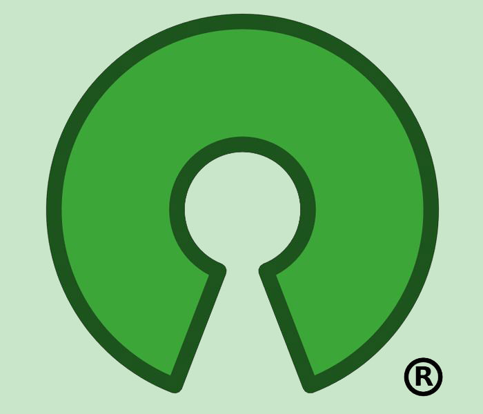

My supervisor at work encouraged me to look into finding several open-source projects that I have an interest in. After some time browsing the featured Google open-source projects, I settled on Oppia, Tesseract OCR, Airport Puzzle Solver, Flutter, and Easy Public Key Infrastructure. To browse the plethora of open-source projects that Google is currently showcasing, please follow the below link:

<a href="https://opensource.google.com/projects/explore/featured">Google Projects</a>

Oppia:

The first project that caught my eye was Oppia, a tool for developing and sharing online lessons collaboratively. This tool reminded me of a project a senior classmate of mine wanted to produce – a tool intended for teachers to use to easily produce online lessons for their students. This type of project fascinates me and I think is going to be an important instrument for future pedagogies of education all around the world. This is also a project I would enjoy experimenting with once completed as I can think of several lessons I wouldn’t mind creating for my friends.

For more information:

<a href="https://opensource.google.com/projects/oppia">Oppia</a>

Tesseract OCR:

This is an OCR, or Optical Character Recognition software that is used to detect text in more than one-hundred languages and can even be trained to learn to detect new languages. Any sort of software that is capable of deciphering what it is looking at and make sense of it fascinates me. I learned a little about the programs used to analyze faces, finger prints, and irises when learning about three-factor authentication in my ICS 355 (Security and Trust I) class, but learning about identifying characters and determining languages sounds equally interesting and complex to me. I would know next to nothing about how such a software would look and function, but that only means that there is plenty of room for me to learn and develop new skills.

For more information:

<a href="https://opensource.google.com/projects/tesseract">Tesseract</a>

Airport Puzzle Solver:

This puzzle involves placing six tiled pieces on top of a board so that all pieces fit together without overlap. And so, this program seeks to analyze a given setup and determine and display the solution to the user. This concept reminds me of the labs I did when I was first learning to program code in Java at Punahou in my AP Computer Science class. Most of my homework assignments were to solve some problem, scenario, game, or puzzle with a written program. This project has a visual element to it which I have no current experience with, but I would still be interesting in working on this project as it would compel me to not only play the game, but break it down and figure out the optimal strategy for completing the puzzle, and then putting that strategy to code that can then do it for me.

For more information:

<a href="https://opensource.google.com/projects/airport">Airport Puzzle Solver</a>

Flutter:

A few friends of mine and I have tossed around the idea of creating a mobile app – something simple, but something that we can out our names on. We would love to garner some experience with developing something that we can release to the real world and so exist beyond a classroom environment. And Flutter is a software development kit for creating mobile apps for both iOS and Android via a single code base. This would be a great tool as one issue that we were discussing was whether or not we wanted to try to develop an app for both markets, or only one. We settled on Android as they have a much more affordable fee for placing an app on their market place. As this potential venture of ours wouldn’t be for profit, we would rather not spend too much money paying fees. However, if we could one day create an app that we would like to then place on the iOS app store, then Flutter would have been an excellent tool to have used when developing our code as we could then save ourselves from having to recreate our app with another language.

For more information:

<a href="https://opensource.google.com/projects/flutter">Flutter</a>

Easy Public Key Infrastructure:

Also in my ICS 355 (Security and Trust I) class, I learned about cryptography fundamentals. I also used the application known as Kleopatra to generate my own set of public and private keys and gained experience with signing colleagues’ keys as well as encrypting and decrypting messages. In fact, I have my public key displayed on my About Me section of my Facebook page simply because there was an option for it. So in case anyone savvy enough to spot it and wished to send me an encrypted message, he or she could feel free to do so. This tool aims to establish client-server authentication and provide for encrypted communications between one’s own systems via an automated integration. I would need to look up how most of that works, but encryption and its many facets of implementation are definitely things I would like to learn more about in the future.

For more information:

<a href="https://opensource.google.com/projects/easypki">Public Key Infrastructure</a>

And for more information on Kleopatra:

<a href="https://www.gpg4win.org/">Kleopatra</a>

Out of all of these above projects, the one I would be the most interested in working on myself would be Oppia, the online lessons utility. The languages being used for this project are JavaScript and Python, both of which I have no prior experience with, but both of which I have an interest in developing. I have on good authority that Python is an excellent language to play around with and is a delight to use given its simplicity. And as for JavaScript, I will be needing to use it for my ICS 314 (Software Engineering I) class, so any extra experience would be of great use to me. So, with an interest in the languages and final product both, Oppia seems like an excellent opportunity for me to attempt to foster and gain new skill sets. This would also be my first time working with an open-source project, something that any computer scientist worth his or her spurs would have by now. I look forward to investigating this project further, and even if I cannot bring myself up to speed with the languages and logic required to develop this program in time to be of assistance to it, I will at the very least be following along with the project during its development and continue to develop my own skills so that I can one day contribute toward another open-sourced project in the future.
